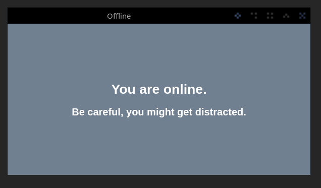

# Offline

A dead simple Electron desktop app designed to help you disconnect from the internet and take a break from the constant stream of notifications, updates, and dumb memes.

It tracks your time spent offline in order to help you focus, be productive, prioritize your mental health by taking a much-needed break from the digital world.

## Screenshots

